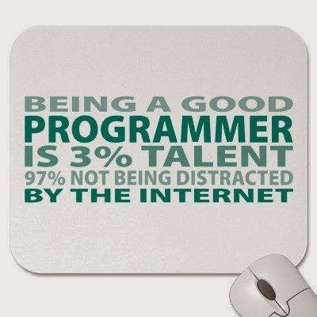

# Junior Java Developer
Zbiór przydatnych materiałów dla osób gotowych do rozpoczęcia swojej przygody z zawodowym programowaniem i szukających drogi dalej.

---

## Prośba 

Jeżeli znalazłeś się tutaj pierwszy raz, albo zaglądasz już kolejny, to daj gwiazdkę temu repozytorium (opcja `Star` w prawym, górnym rogu).
Z góry bardzo dziękuję :)

---

## Wstęp

Przed ropoczęciem korzystania z udostępnionych tutaj materiałów zapoznaj się z kilkoma podstawowymi informacjami.

---

### Nota prawna

Drogi użytkowniku. Ze względu na ochronę wartości intelektualnej zachęcam Cię, abyś
na wstępie zapoznał się z poniższą notą prawną dotyczącą repozytorium. Uzyskałeś dostęp do repozytorium
i tym samym poniższe zapisy w całości Cię dotyczą. Proszę Cię o współpracę w ochronie tej wartości i przestrzeganie
niżej opisanych zasad. Dziękuję.

>Repozytorium, jego treść i zawartość podlegają ochronie prawnej. Wykorzystywanie materiałów
zawartych w repozytorium może odbywać się tylko za zgodą autora.

>Repozytorium jest **prywatne**. Udostępniane jest wybranym osobom i tylko przez te osoby może być wykorzystywane. 
Dalsze rozpowszechnianie i/lub kopiowanie repozytorium bez zgody autora, w całości lub we fragmentach, jest zabronione.

>Autorem i właścicielem repozytorium jest Michał Kupisiński Honest IT Consulting. 

>Repozytorium oraz każda jego kopia (fork) muszą zachować powyższą notę prawną.

---

### Materiały w repozytorium

Zebrane materiały w repozytorium są wybiórczym i subiektwynym zbiorem, który ma prawo się zmieniać.
Jednocześnie umieszczenie tego zbioru na poziomie repozytorium Git gwarantuje utrzymanie historii
zmian, więc jeżeli taką jesteś zainteresowany, to czuj się wolny do śmiałego przeglądania hsitorii zmian.

---

### Rozwój zbioru materiałów

Materiały będą rozwijane przeze mnie, ale również Ty, drogi Użytkowniku, jeżeli tylko
masz wiedzę o wartościowych materiałach i chciałbyś takie zaproponować, to możesz śmiało zaktualizować zestaw
materiałów wykonując `pull-request` (w razie potrzeby wsparcia: [*pull request*](https://help.github.com/articles/creating-a-pull-request)).
Każda wykonana aktualizacja wymaga mojego zatwierdzenia. Propozycje zmian będę przeglądał przynajmniej raz w tygodniu, aby
zbiór pozostał aktualny. Każdą złożoną przez Ciebie propozycję oznaczę też Twoim loginem, aby pamięć o Tobie nie umarła! ;)

**Będąc tutaj korzystasz z wiedzy innych, więc gorąco Cię zachęcam, abyś wpłynął na rozwój zgromadzonych tu treści.**

---

## Materiały

Zebrane materiały przeznaczone są dla osób, które posiadają już podstawową znajomość języka Java oraz
towarzyszących im kategorii. Udostępnienione materiały nie mają charakteru planu nauczania języka Java
czy przygotowania do stanowiska Junior Java Developer.

Rolą udostępnionych tutaj materiałów jest wskazanie możliwości dalszej nauki i samodzielnego rozwoju
w poznanych technologiach i elementach języka Java.

---

### Aktualizacja

- 2019-09-19 **WYRÓŻNIONE** W trakcie jednej z rozmów rekrutacyjnych Marcin [wuher44](https://github.com/wuher44) opowiedział o portalu [hyperskill.org](https://hyperskill.org/knowledge-map/73?v=table). _Miejsce_ to oceniam jako genialne. Już wskazanie kto jest autorem tych materiałów wiele mówi: JetBrains, a więc wydawcy IntelliJ. Nie wiem jakim cudem dopiero teraz wpadło to w moje ręcę :) Od razu dziele się tym z całą tutejszą grupą i wszystkimi nadchodzącymi.
- 2019-07-19 Dodano wyróznioną pozycję dotyczącą zasad SOLID. Bardzo często pojawiają się one w trakcie naszych rozmów IT Interview, czy z mojej inicjatywy czy z Waszej. Warto zapoznać się ich praktyczną realizacją na wybranych przykładach czystej Javy. **Polecam, aby skoczyć wyżej w zasadach tworzenia oprogramowania o wysokiej jakości**.
- 2019-06-28 Dodano wyróżnioną pozycję z wylistowanym zakresem wymagań dotyczących Junior Java Developer. Bardzo kompleksowa lista (aż tyle nie trzeba umieć), ale jednocześnie z podliknowanymi materiałami do każdego z tematów. **Polecam jako _checklistę na ile jestem przygotowany/przygotowana_**.
- 2019-03-15 Dodano nową sekcję `Przygotowanie do rozmowy rekrutacyjnej` z pierwszym materiałem, a więc serwisem Pramp. Za cenną propozycją [ziehlke](https://github.com/ziehlke). 
- 2019-03-15 Dodano do `Zadania i tutoriale` nową pozycję: "_HTML RefCard_". Podstawowe elementy HTML w formie szybkiej pomocy.
- 2019-01-31 Dodano do [Książki](#Ksiazki) nową pozycję: "_Myśl jak programista. Techniki kreatywnego rozwiązywania problemów_". Lektura polecana absolutnie dla wszystkich, którzy chcą zrozumieć, co jest w tym zawodzie najważniejsze: nie język, nie framework, nie środowisko i narzędzia, a właściwy sposób myślenia (możliwy do wyuczenia krok po kroku).
- 2018-12-14 Dodano do [Książki](#Ksiazki) nową pozycje: "_Programowanie w Javie. Solidna wiedza w praktyce. Wydanie XI_". Szczególnie polecam tą książkę, jako źródło całościowej wiedzy o języku Java. Uczyłem się od tych autorów programowania w C++ 20 lat temu, z książki "Arkana Programowania C++". Nigdy w swoim całym życiu zawodowym nie spotkałem już innej pozycji tak kompleksowej jak ta. Gorąco polecam!
- 2018-12-14 Dodano do [Książki](#Ksiązki) nową pozycje: "_Java. Przewodnik dla początkujących. Wydanie VII_", od [AdrianGalus](https://github.com/AdrianGalus). Tym samym pojawiła się pierwsza aktywność naszej mikro społeczności :)
- 2018-12-07 Dodano do #ksiazki nowe pozycje związane ze Spring Framework oraz klasyczną Javą.

---

### Kategorie materiałów

Materiały zebrane są w trzech kategoriach:
1. Książki - materiały podstawowe, które pozwalają poznać kompleksowo wybrane zagadnienia
2. Tutoriale - materiały praktyczne, ktore pozwalają opanować wiele zagadnień w formie zadań czy tutoriali
3. Specjalistyczne - materiały omawiające wybrane zagadnienia z programowania lub konkretne technologie

Wszystkie materiały zostały udostępnione w formie pytań. Jeżeli na zadane przy materiale pytanie
odpowiadasz "TAK", to materiał ten jest dla Ciebie. W pierwszej kolejności skup się na materiałach,
dla których odpowiadasz stanowczo "TAK". 

Nie skacz po wszystkim - Internet jest dzisiaj tak przepełniony treścią,
często bezużyteczną, że możesz całe życie poświęcić na samo szukanie, z którego nic nie wyniesiesz. Lepiej wybierz swoje największe "TAK" i skup się tylko
na nim. Potem kolejne, kolejne. Dobrze oddaje to poniższa grafika:

(Źródło: [tutaj](https://2.bp.blogspot.com/-rXTKoaxaE0k/WjT1QXzXnyI/AAAAAAAAJtY/9joXTM06QigGYFBh0AJjWWf_YYqzmL8mgCLcBGAs/s400/Good%2Bprogrammer.jpg))

---

### Wytyczne co powinien umieć "Junior Java Developer"

Na stronie Java Code Geeks kilka miesięcy temu pojawiła się bardzo kompleksowa lista tego, co powinna nauczyć się osoba chcąca zostać Junior Java Developer. Lista jest szeroka i część wymagań może być ponad rozpoczęcie kariery. Jednak olbrzymią wartością tej listy jest to, że każde z wymagań posiada również linki do materiałów, z których można się ich nauczyć bądź zweryfikować już posiadaną wiedzę. Gorąco polecam!

[Co Junior Java Developer umieć powinien](https://www.javacodegeeks.com/2019/04/best-way-to-learn-java-programming-online.html)

---

### Zasady SOLID

Zrozumienie dobrych praktyk programistycznych i umiejętność ich samodzielnej obrony, zaprezentowania na przykładach (swoich i cudzych) jest kluczem do tego, aby wyróżnić się na rozmowie rekrutacyjnej. Również jest bramą do Waszego samorozwoju. Jeżeli zastanowicie się nad tym jak wygląda dzisiaj programowanie, to niemal każdy problem został już rozwiązany i można go znaleźć przeważnie na StackOverflow. Zatem wyzwaniem, które dzisiaj rzuca programowanie nie jest napisanie działającego fragmentu kodu, a pisanie kodu w taki sposób, aby idealnie łączył się z innymi fragmentami. Prawdziwym wyzwaniem jest więc projektowanie, a nie programowanie. Zasady SOLID otwierają Wam drogę i pozwalają wystartować z dobrej pozycji. Jedno z najlepszych (o ile nie najlepsze) opracowanie poniżej:

[Zasady SOLID](https://blog.bitsrc.io/solid-principles-every-developer-should-know-b3bfa96bb688)

---

### Książki

Poniżej prezentuję subiektywną listę książek, które dla osoby aspirującej do stanowiska Junior Java Developer
będą przydatne i wartościowe:

|Pytanie|Materiał|Autor propozycji|
|:------|:-------|:--------------:|
|**Wyróżnione:** Jeżeli zgadzasz się ze mną, że nie istnieją predyspozycje do programowania, a umiejętności, które masz dzisiaj, jutro mogą być na zupełnie innym, wyższym poziomie, to ta książka jest dla Ciebie. Jeżeli się nie zgadzasz, to ta książka też jest dla Ciebie|[_Myśl jak programista. Techniki kreatywnego rozwiązywania problemów_](https://helion.pl/view/10695k/myprog.htm#format/e), V. Anton Spraul|[honestit](https://github.com/honestit)|
|**Wyróżnione:** Całościowy, kompleksowy przegląd języka Java na najwyższym poziomie|[_Programowanie w Javie. Solidna wiedza w praktyce. Wydanie XI_](https://helion.pl/view/10695k/prjaso.htm#format/d)|[honestit](https://github.com/honestit)|
|Czy chciałbyś raz jeszcze w lekki sposób dowiedzieć się o języku Java?|[_Java. Przewodnik dla początkujących_](https://helion.pl/view/10695k/javpp7.htm#format/d), Herbert Schildt|[AdrianGalus](https://github.com/AdrianGalus)|
|Czy potrzebujesz jeszcze raz zrozumieć pewne podstawowe zagadnienia z języka Java?|[_JAVA. Programowanie praktyczne od podstaw_](https://ksiegarnia.pwn.pl/JAVA.-Programowanie-praktyczne-od-podstaw,216634685,p.html), Krzysztof Barteczko|[honestit](https://github.com/honestit)|
|Czy potrzebujesz zrozumieć zagadnienia zaawansowane język Java?|[_JAVA. Uniwersalne techniki programowania_](https://ksiegarnia.pwn.pl/Java.-Uniwersalne-techniki-programowania,114622614,p.html), Krzysztof Barteczko|[honestit](https://github.com/honestit)|
|Czy masz trudności z formułowaniem algorytmów i rozwiązywaniem zadań programistycznych?|[_Myśl w języku Java. Nauka programowania_](https://helion.pl/view/10695k/mysjav.htm#format/d), Allen B. Downey, Chris Mayfield|[honestit](https://github.com/honestit)|
|Czy potrzebujesz poznać bardziej zaawansowane zagadnienia i dowiedzieć się JAK należy języka Java używać?|[_Java. Efektywne programowanie. Wydanie III_](https://helion.pl/view/10695k/javep3.htm#format/d), Joshua Bloch|[honestit](https://github.com/honestit)|
|Potrafisz sprawnie posługiwać się językiem Java i rozumiesz poznane zagadnienia, ale szukasz pełnego przeglądu języka Java w zakresie młodszego programisty?|[_Java. Podstawy_](https://helion.pl/view/10695k/javp10.htm#format/e), Cay S. Horstmann oraz [_Java. Techniki zaawansowane_](https://helion.pl/view/10695k/javtzx.htm#format/d), Cay S. Horstmann|[honestit](https://github.com/honestit)|
|Chcesz zmierzyć się z różnego rodzaju łamigłowkami z pomocą języka Java?|[_Java Puzzlers_](http://www.javapuzzlers.com/), Joshua Bloch, Neal Gafter|[honestit](https://github.com/honestit)|
|Rozumiesz język Java i chcesz poznać szerszy obraz tego co przed Tobą?|[_The Well Grounded Java Developer_](https://www.manning.com/books/the-well-grounded-java-developer), Benjamin J. Evans, Martijn Verburg|[honestit](https://github.com/honestit)| 
|Potrzebujesz raz jeszcze zrozumieć Spring MVC?|[_Spring MVC. Przewodnik dla początkujących_](https://helion.pl/view/10695k/sprimv.htm#format/e), Amuthan G. oraz [_Spring MVC 4. Projektowanie zaawansowanych aplikacji_](https://helion.pl/view/10695k/smvc4p.htm#format/d), Geoffroy Warin|[honestit](https://github.com/honestit)|
|Rozumiesz już Spring Framework i potrzebujesz pozycji przeglądowej, zawsze pod ręką?|[_Spring w akcji_](https://helion.pl/view/10695k/sprwa4.htm#format/d), Craig Walls|[honestit](https://github.com/honestit)|
|Jeżeli radzisz sobie z programowaniem, ale czujesz, że jakość tego co robisz mogłaby być wyższa?|[_Czysty Kod. Podręcznik dobrego programisty_](https://helion.pl/view/10695k/czykov.htm#format/d) Robert C. Martin|[honestit](https://github.com/honestit)|
|Chcesz zrozumieć współczesne programowanie i osiągnąć w nim mistrzostwo?|[_Software Craftsman. Profesjonalizm, czysty kod i techniczna perfekcja_](https://helion.pl/view/10695k/prorze.htm#format/d), Sandro Manusco|[honestit](https://github.com/honestit)|
|Zachłysnąłeś/aś się programowaniem i szukasz inspirujących historii?|[_Piękny kod. Tajemnice mistrzów programowania_](https://helion.pl/view/10695k/szpppv.htm#format/d), Andy Oram, Greg Wilson|[honestit](https://github.com/honestit)|

---

### Zadania i tutoriale

Kolejna lista to strony zawierająca zbiory zadań i tutoriale pod konkretne obszary techniczne

#### Zbiory zadań

|Pytanie|Materiał|Autor propozycji|
|:------|:-------|:--------------:|
|**Wyróżnione:** Jeżeli potrzebujesz całościowego zestawu zadań, pokrywającego WSZYSTKO co musisz wiedzieć, stworzonego w sposób niezwykle atrakcyjny i w okół budowania mini projektów - TO TUTAJ|[hyperskill.org](https://hyperskill.org/knowledge-map/73?v=table)|[wuher44](https://github.com/wuher44)|
|Czy masz problem z układaniem podstawowych algorytmów i samodzielnym wykorzystywaniem podstaw języka?|[CodingBat](https://codingbat.com/java)|[honestit](https://github.com/honestit)|
|Czy chcesz rozwinąć swoje umiejętności rozwiązywania zadań algorytmicznych na trudniejszych przykładach?|[SPOJ](https://pl.spoj.com/)|[honestit](https://github.com/honestit)|
|Chcesz ćwiczyć programowanie rozwiązując zadania i mając z tego sporo frajdy?|[Hacker Rank](https://www.hackerrank.com/)|[honestit](https://github.com/honestit)|
|j.w.|[CodeWars](https://www.codewars.com/)|[honestit](https://github.com/honestit)|
|j.w.|[CodingGame](https://www.codingame.com/start)|[honestit](https://github.com/honestit)|
|j.w.|[Leet Code](https://leetcode.com/)|[honestit](https://github.com/honestit)|
|j.w.|[Coderbyte](https://coderbyte.com/)|[honestit](https://github.com/honestit)|
|Chcesz przygotować się do zadań, z którymi możesz się spotkać na rozmowie rekrutacyjnej?|[Codility](https://app.codility.com/programmers/)|[honestit](https://github.com/honestit)|

#### Tutoriale

|Pytanie|Materiał|Autor propozycji|
|:------|:-------|:--------------:|
|Chcesz poznać konkretne sposoby (przepisy) rozwiązania problemów technicznych na zasadzie "How to do"?|[Jenkov](http://tutorials.jenkov.com/)|[honestit](https://github.com/honestit)|
|j.w.|[JavaTpoint](https://www.javatpoint.com/java-tutorial)|[honestit](https://github.com/honestit)|
|j.w.|[Java online](https://www.learnjavaonline.org/)|[honestit](https://github.com/honestit)|
|j.w.|[Tutorials point](https://www.tutorialspoint.com/)|[honestit](https://github.com/honestit)|

#### Zagadnienia zaawansowane

Ostatnia, ale największa lista, dotyczy już konkretnych obszarów technicznych w świecie języka Java. Jeżeli mogę Ci coś zasugerować, to
znajdź temat, który Ci się spodobał i rozwijaj się w nim. Nie próbuj nauczyć się wszystkiego, bo to niemożliwe. Skup się na tym, co wydało Ci się 
najbardziej atrakcyjne, najciekawsze i w ten sposób buduj swój potencjał i pozycję.

##### Projektowanie aplikacji

|Pytanie|Materiał|Autor propozycji|
|:------|:-------|:--------------:|
|Potrafisz programować, ale chcesz lepiej poznać zasady projektowania i rozpocząć przygodę ze wzorcami|[JournalDev Design Patterns](https://www.journaldev.com/1827/java-design-patterns-example-tutorial)|[honestit](https://github.com/honestit)|
|Podstawowa grupa wzorców to dla Ciebie już za mało i chcesz wejść naprawdę głęboko i szeroko w temat?|[Java Design Pattersn](https://github.com/iluwatar/java-design-patterns)|[honestit](https://github.com/honestit)|
|Korzystasz z framework'ów typu Hibernate lub Spring/JEE i chce je zrozumieć?| | |
|- Chcesz poznać źródło wszystkiego?|[Enterprise Patterns Catalog](https://martinfowler.com/eaaCatalog/)|[honestit](https://github.com/honestit)|
|- Interesuje Cię po co jest warstwa serwisów?|[Service Layer](https://martinfowler.com/eaaCatalog/serviceLayer.html)|[honestit](https://github.com/honestit)|
|- Obiekty transferowe wydają Ci się tylko przepisywaniem kodu?|[Data Transfer Object](https://martinfowler.com/eaaCatalog/dataTransferObject.html)|[honestit](https://github.com/honestit)|
|- Zastanawiasz się o co chodzi z tymi transakcjami w serwisach?|[Transaction Script](https://martinfowler.com/eaaCatalog/transactionScript.html)|[honestit](https://github.com/honestit)|
|- Nie wiesz czemu poza transakcją musisz zapisać zmiany w encjach, a wewnątrz transackji zapisują się same?|[Unit of Work](https://martinfowler.com/eaaCatalog/unitOfWork.html)|[honestit](https://github.com/honestit)|
|- Chcesz zrozumieć różnice między Servletami i np. Spring MVC?|[Front Controller](https://martinfowler.com/eaaCatalog/frontController.html)|[honestit](https://github.com/honestit)|
|- Stosujesz wzorzec MVC, ale czasami zastanawiasz się czym jest "M"?|[MVC](https://martinfowler.com/eaaCatalog/modelViewController.html), [Page Controller](https://martinfowler.com/eaaCatalog/pageController.html)|[honestit](https://github.com/honestit)|
|- Wykorzystujesz repozytoria albo dao?|[Repository](https://martinfowler.com/eaaCatalog/repository.html)|[honestit](https://github.com/honestit)|
|- Zastanawiasz się jaką rolę pełni `EntityManager`?|[Identity Map](https://martinfowler.com/eaaCatalog/identityMap.html)|[honestit](https://github.com/honestit)|
|- Czym są Twoje encje i jaką magię czyni Hibernate?|[Data Mapper](https://martinfowler.com/eaaCatalog/dataMapper.html)|[honestit](https://github.com/honestit)|
|- Nurtuje Cię po co encji ten klucz główny?|[Identity Field](https://martinfowler.com/eaaCatalog/identityField.html)|[honestit](https://github.com/honestit)|
|- Męczy Cię błąd `could not initialize lazy collection...`?|[Lazy Load](https://martinfowler.com/eaaCatalog/lazyLoad.html)|[honestit](https://github.com/honestit)|
|- Korzystasz z `Criteria API` i chcesz wiedzieć jak to się ma do wzorców projektowych?|[Query Object](https://martinfowler.com/eaaCatalog/queryObject.html)|[honestit](https://github.com/honestit)|
|- Jeżeli poznanie wierzchołka góry lodowej to dla Ciebie za mało?|[Patterns of Enterprise Architecture](https://martinfowler.com/books/eaa.html), Martin Fowler ([wydanie polskie](https://helion.pl/ksiazki/architektura-systemow-zarzadzania-przedsiebiorstwem-wzorce-projektowe-martin-fowler,szabko.htm#format/d))|[honestit](https://github.com/honestit)|

##### JPA, Hibernate i SQL

|Pytanie|Materiał|Autor propozycji|
|:------|:-------|:--------------:|
|Polubiłeś/aś `Java Persistence API` i chcesz je poznać w całośći?|[Java Persistene API Specification](https://jcp.org/en/jsr/detail?id=338)|[honestit](https://github.com/honestit)|
|`JPA` jest interesujące ale bardziej jesteś ciekaw/a możliwości Hibernate'a?|[Vlad Mihalcea Blog](https://vladmihalcea.com/)|[honestit](https://github.com/honestit)|
|Czujesz, że SQL jest Twoim żywiołem albo że będzie Ci potrzebny i potrzebujesz lepiej wszystko zrozumieć?|[SQL ZOO](https://sqlzoo.net/)|[honestit](https://github.com/honestit)|

##### Servlety i Spring MVC

|Pytanie|Materiał|Autor propozycji|
|:------|:-------|:--------------:|
|Polubiłeś/aś `Java Servlets` i aplikacje webowe, chcesz poznać wszystko w całości?|[Java Servlets 4.0 Specification](https://jcp.org/en/jsr/detail?id=369)|[honestit](https://github.com/honestit)|
|Znasz już Servlety i chcesz lepiej poznać Spring'a?|[Spring Project](https://spring.io/guides)|[honestit](https://github.com/honestit)|
|Spring jest świetny, ale oficjalna dokumentacja trochę Cię przerażą?|[Baeldung](https://www.baeldung.com/start-here)|[honestit](https://github.com/honestit)|

##### Przygotowanie do rozmowy kwalifikacyjnej

Nie wiesz czy jesteś już gotowy wysyłać CV na oferty pracy? Chcesz spóbować swoich sił przed prawdziwą rozmową kwalifikacyjną? Skorzystaj z portali, gdzie możesz umówić się z innymi osobami takimi jak Ty:

|Pytanie|Materiał|Autor propozycji|
|:------|:-------|:--------------:|
|Darmowa rejestracja i kredyty na pierwsze rozmowy - odbywając rozmowy zdobywasz kredyt na kolejne|[Pramp](https://www.pramp.com/#/)|[ziehlke](https://github.com/ziehlke)|

##### Wszystko w jednym miejscu - RefCardz

W sytuacji, kiedy dana technologia jest już Ci znana, ale chcesz szybko odświeżyć informacje (idealne przed rozmową rekrutacyjną), to polecam
poniższą listę:

|Pytanie|Materiał|Autor propozycji|
|:------|:-------|:--------------:|
|Java:| | |
|- Podstawy|[Java Core](https://dzone.com/refcardz/core-java?chapter=1)|[honestit](https://github.com/honestit)|
|- Wielowątkowość|[Java Concurrency](https://dzone.com/refcardz/core-java-concurrency?chapter=1)|[honestit](https://github.com/honestit)|
|- Cacheowanie|[Java Caching](https://dzone.com/refcardz/java-caching?chapter=1)|[honestit](https://github.com/honestit)|
|- JPA|[Started with JPA](https://dzone.com/refcardz/getting-started-with-jpa?chapter=1), [JPA 2.0](https://dzone.com/refcardz/whats-new-jpa-20?chapter=1)|[honestit](https://github.com/honestit)
|Narzędzia:| | |
|- IntelliJ|[IntelliJ](https://dzone.com/refcardz/intellij-idea-update?chapter=1)|[honestit](https://github.com/honestit)|
|- Git|[Git](https://dzone.com/refcardz/getting-started-git?chapter=1)|[honestit](https://github.com/honestit)|
|- Maven|[Maven](https://dzone.com/refcardz/getting-started-repository?chapter=1)|[honestit](https://github.com/honestit)|
|- Tomcat|[Tomcat](https://dzone.com/refcardz/getting-started-with-apache-tomcat?chapter=1)|[honestit](https://github.com/honestit)
|Technologie:| | |
|- JUnit|[JUnit and EasyMock](https://dzone.com/refcardz/junit-and-easymock?chapter=1)|[honestit](https://github.com/honestit)|
|- Wyrażenia regularne|[Regex](https://dzone.com/refcardz/regular-expressions?chapter=1)|[honestit](https://github.com/honestit)|
|- Protokół HTTP|[HTTP](https://dzone.com/refcardz/http-hypertext-transfer-0?chapter=1)|[honestit](https://github.com/honestit)|
|- JSON|[JSON](https://dzone.com/refcardz/core-json?chapter=1)|[honestit](https://github.com/honestit)|
|- HTML|[HTML Core](https://dzone.com/asset/download/192)|[honestit](https://github.com/honestit)|
|- HTML5|[HTML5 Features](https://dzone.com/refcardz/html5-new-standards-web-interactivity?chapter=1)|[honestit](https://github.com/honestit)|
|- CSS|[CSS 1](https://dzone.com/refcardz/corecss-part1?chapter=1), [CSS 2](https://dzone.com/refcardz/corecss2?chapter=1), [CSS 3](https://dzone.com/refcardz/corecss3?chapter=1)|[honestit](https://github.com/honestit)|
|Projektowanie:| | |
|- Refaktoryzacja|[Refactoring Patterns](https://dzone.com/refcardz/refactoring-patterns?chapter=1)|[honestit](https://github.com/honestit)|
|- Wzorce GoF|[Design Patterns](https://dzone.com/refcardz/design-patterns?chapter=1)|[honestit](https://github.com/honestit)|
|- Wzorce architektoniczen|[Modular Patterns](https://dzone.com/refcardz/patterns-modular-architecture?chapter=1)|[honestit](https://github.com/honestit)|
|- Wzorce integracyjne|[SOA Patterns](https://dzone.com/refcardz/soa-patterns?chapter=1)|[honestit](https://github.com/honestit)|

---

## Podsumowanie

Mam nadzieję, że powyższa lista będzie dla Ciebie dobrym przejściem od nauki programowania do rozpoczęcia kariery w branży IT. Jeżeli
choć jeden z zamieszczonych tutaj linków przyczyni się do Twojego sukcesu, to będzie to wystarczające wynagrodzenia.

## Powodzenia!

